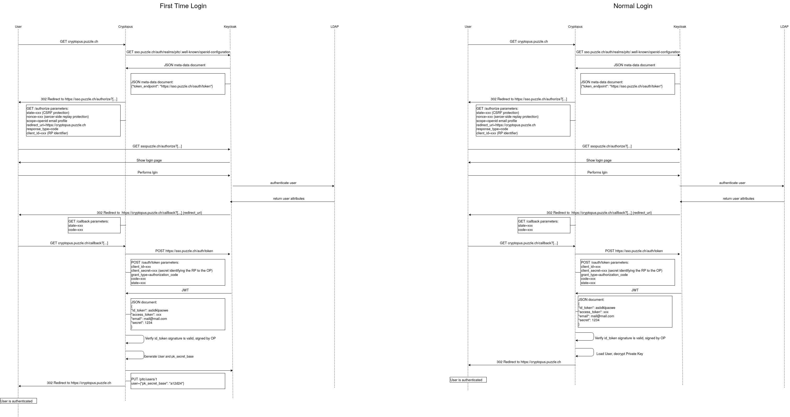

Aktuell funktioniert die Verschlüsselung vom User Private Key in Cryptopus mit dem User-Passwort. In Zukunft wird dies jedoch nicht mehr möglich sein da mit Keycloak Cryptopus keinen Zugriff mehr aufs Passwort hat.

Unter Keycloak wird das Passwort ersetzt, mit einer Kombo von PSB(pk_secret_base) vom User und dem Secret Key Base von Rails. Das PSB wird erstellt wenn sich der User das erste mal anmeldet. Das PSB wird in Keycloak abgelegt. Beim anmelden wird das PSB via JWT an Cryptopus weitergegeben und dann in der Session abgelegt.

Systemübersicht von Cryptopus 2.0 zu 3.0

Kommunikation für Authentifizierung in Cryptopus mit Keycloak.

Die Kommunikation folgt dem OpenId Protokoll.

#### Neuer User

1. User mit Keycloak authentifizieren
1. User in Cryptopus erstellen
1. PSB und Rsa erstellen für User
1. Private Rsa Key mit Kombo von PSB und Secret Key Base verschlüsseln in DB speichern
1. PSB an keycloak API schicken um Keycloak-User zu aktualisieren
1. PSB und Private Rsa Key aus JWT in Session speichern

#### Bestehender User

1. User mit Keycloak authentifizieren
1. Private Rsa Key mit mit Kombo von PSB und Secret Key Base entschlüsseln
1. PSB und Private Rsa Key aus JWT in Session speichern
